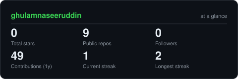
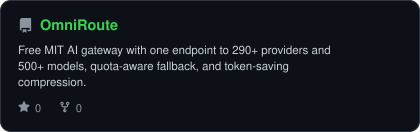
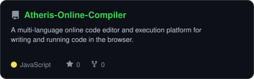
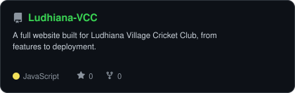
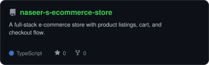
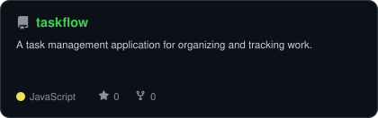
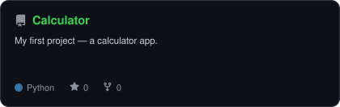

<div align="center">

<!-- PORTRAIT - generated by scripts/dotify.py from assets/jacket.png.
     Colour mode, so one file serves both GitHub themes. Regenerate with:
       python scripts/dotify.py assets/jacket.png -o assets/portrait \
         --cols 100 --equalize --detail 0.5 --color -->

<br>
<!-- NAME / TAGLINE - animated typing -->
<a href="https://github.com/ghulamnaseeruddin">
  
</a>
<br>
<!-- SOCIALS -->
<a href="https://www.linkedin.com/in/ghulam-naseeruddin-4a3570398"></a>
<a href="mailto:ghulamnaseeruddin555@gmail.com"></a>

</div>

---

## `~/` whoami
```console
$ cat about.txt
```
Hi, I'm **Ghulam Naseeruddin**. I build full-stack web, mobile & desktop apps and AI/ML systems,
and I like figuring out how things work under the hood.
- Currently building **[Taskflow](https://github.com/ghulamnaseeruddin/taskflow)**
- Exploring **how advanced AI can be made more useful and accessible for everyone, everywhere**
- Fun fact: **I'd rather build the tool I wish existed than wait for someone else to make it.**
<br>

<div align="center">

## `~/` toolbox


</div>

---

<div align="center">

## `~/` skill radar

<table>
<tr>
<td width="50%" align="center" valign="middle">

<!-- Self-rated radar - edit assets/skills.json, the workflow redraws it -->
<picture>
  <source media="(prefers-color-scheme: dark)"  srcset="assets/radar-dark.svg">
  <source media="(prefers-color-scheme: light)" srcset="assets/radar-light.svg">
  
</picture>

</td>
<td width="50%" align="center" valign="middle">

<!-- Live radar built from real language byte counts across your repos -->
<picture>
  <source media="(prefers-color-scheme: dark)"  srcset="assets/radar-langs-dark.svg">
  <source media="(prefers-color-scheme: light)" srcset="assets/radar-langs-light.svg">
  
</picture>

</td>
</tr>
</table>

</div>

---

<div align="center">

## `~/` contribution calendar

<!-- 3D isometric calendar, regenerated every 6h by .github/workflows/metrics.yml -->


<br><br>

<!-- Snake eats the contribution graph - .github/workflows/snake.yml -->
<picture>
  <source media="(prefers-color-scheme: dark)"  srcset="httpls://raw.githubusercontent.com/ghulamnaseeruddin/ghulamnaseeruddin/output/snake-dark.svg">
  <source media="(prefers-color-scheme: light)" srcset="https://raw.githubusercontent.com/ghulamnaseeruddin/ghulamnaseeruddin/output/snake.svg">
  
</picture>

</div>

---

<div align="center">

## `~/` the numbers

<!-- Generated by scripts/cards.py into this repo. Deliberately NOT
     github-readme-stats / streak-stats / github-profile-trophy: those are
     shared public instances that go down and take the whole section with them. -->
<picture>
  <source media="(prefers-color-scheme: dark)"  srcset="assets/card-stats-dark.svg">
  <source media="(prefers-color-scheme: light)" srcset="assets/card-stats-light.svg">
  
</picture>

<br>


<br><br>


</div>

---

<div align="center">

## `~/` selected work

<!-- Cards generated by scripts/cards.py from assets/projects.json.
     Stars, forks and language are pulled live from the API on every run. -->
<table>
<tr>
<td width="50%">
  <a href="https://github.com/ghulamnaseeruddin/OmniRoute">
    <picture>
      <source media="(prefers-color-scheme: dark)"  srcset="assets/card-OmniRoute-dark.svg">
      <source media="(prefers-color-scheme: light)" srcset="assets/card-OmniRoute-light.svg">
      
    </picture>
  </a>
</td>
<td width="50%">
  <a href="https://github.com/ghulamnaseeruddin/Atheris-Online-Compiler">
    <picture>
      <source media="(prefers-color-scheme: dark)"  srcset="assets/card-Atheris-Online-Compiler-dark.svg">
      <source media="(prefers-color-scheme: light)" srcset="assets/card-Atheris-Online-Compiler-light.svg">
      
    </picture>
  </a>
</td>
</tr>
<tr>
<td width="50%">
  <a href="https://github.com/ghulamnaseeruddin/Atheris-Hotel-Web">
    <picture>
      <source media="(prefers-color-scheme: dark)"  srcset="assets/card-Atheris-Hotel-Web-dark.svg">
      <source media="(prefers-color-scheme: light)" srcset="assets/card-Atheris-Hotel-Web-light.svg">
      
    </picture>
  </a>
</td>
<td width="50%">
  <a href="https://github.com/ghulamnaseeruddin/Ludhiana-VCC">
    <picture>
      <source media="(prefers-color-scheme: dark)"  srcset="assets/card-Ludhiana-VCC-dark.svg">
      <source media="(prefers-color-scheme: light)" srcset="assets/card-Ludhiana-VCC-light.svg">
      
    </picture>
  </a>
</td>
</tr>
<tr>
<td width="50%">
  <a href="https://github.com/ghulamnaseeruddin/naseer-s-ecommerce-store">
    <picture>
      <source media="(prefers-color-scheme: dark)"  srcset="assets/card-naseer-s-ecommerce-store-dark.svg">
      <source media="(prefers-color-scheme: light)" srcset="assets/card-naseer-s-ecommerce-store-light.svg">
      
    </picture>
  </a>
</td>
<td width="50%">
  <a href="https://github.com/ghulamnaseeruddin/taskflow">
    <picture>
      <source media="(prefers-color-scheme: dark)"  srcset="assets/card-taskflow-dark.svg">
      <source media="(prefers-color-scheme: light)" srcset="assets/card-taskflow-light.svg">
      
    </picture>
  </a>
</td>
</tr>
<tr>
<td width="50%">
  <a href="https://github.com/ghulamnaseeruddin/Calculator">
    <picture>
      <source media="(prefers-color-scheme: dark)"  srcset="assets/card-Calculator-dark.svg">
      <source media="(prefers-color-scheme: light)" srcset="assets/card-Calculator-light.svg">
      
    </picture>
  </a>
</td>
<td width="50%"></td>
</tr>
</table>

<sub>

| project | live | stack |
|---|---|---|
| **[OmniRoute](https://github.com/ghulamnaseeruddin/OmniRoute)** | — | `MIT` `AI Gateway` |
| **[Atheris Online Compiler](https://github.com/ghulamnaseeruddin/Atheris-Online-Compiler)** | [atheris-online-compiler...railway.app](https://atheris-online-compiler-by-naseer-production.up.railway.app) | `JavaScript` |
| **[Atheris Hotel Web](https://github.com/ghulamnaseeruddin/Atheris-Hotel-Web)** | — | `JavaScript` |
| **[Ludhiana VCC](https://github.com/ghulamnaseeruddin/Ludhiana-VCC)** | [ludhiana-vcc...workers.dev](https://ludhiana-vcc-by-ghulam-naseeruddin.ghulam-naseeruddin.workers.dev) | `JavaScript` |
| **[E-Commerce Store](https://github.com/ghulamnaseeruddin/naseer-s-ecommerce-store)** | [naseer-s-ecommerce-store...workers.dev](https://naseer-s-ecommerce-store.ghulamnaseeruddin555.workers.dev) | `TypeScript` |
| **[Taskflow](https://github.com/ghulamnaseeruddin/taskflow)** |(https://taskfloww-blond.vercel.app)|`CSS` |
| **[Calculator](https://github.com/ghulamnaseeruddin/Calculator)** | — | `Python` |

</sub>

</div>

---

<div align="center">

<sub>`01110100 01101000 01100001 01101110 01101011 01110011 00100000 01100110 01101111 01110010 00100000 01110011 01100011 01110010 01101111 01101100 01101100 01101001 01101110 01100111`</sub>

</div>
